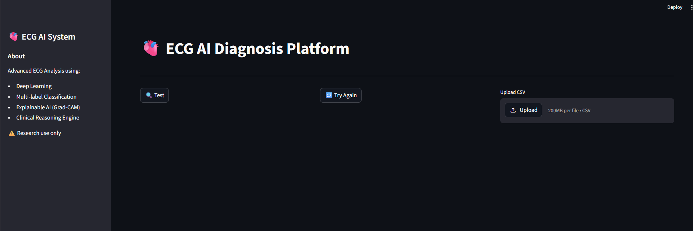
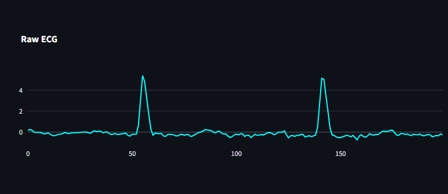
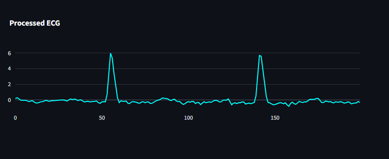
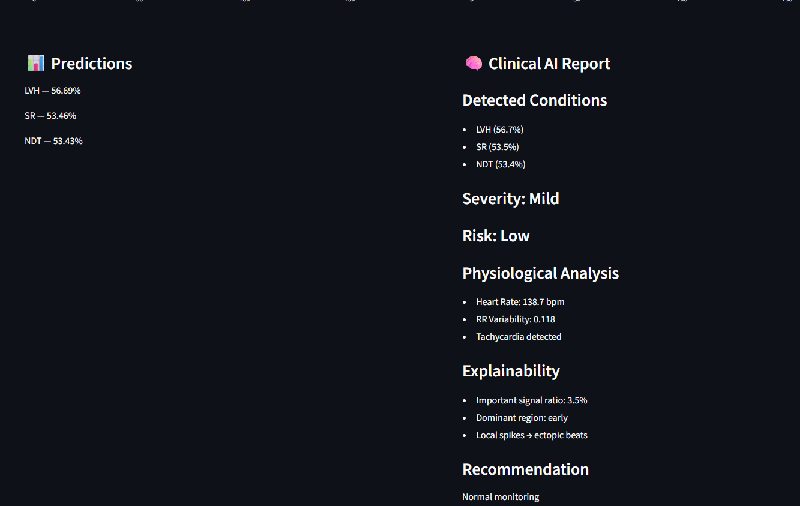
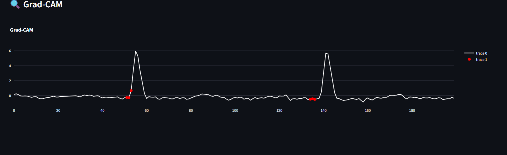
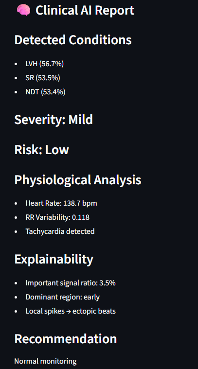
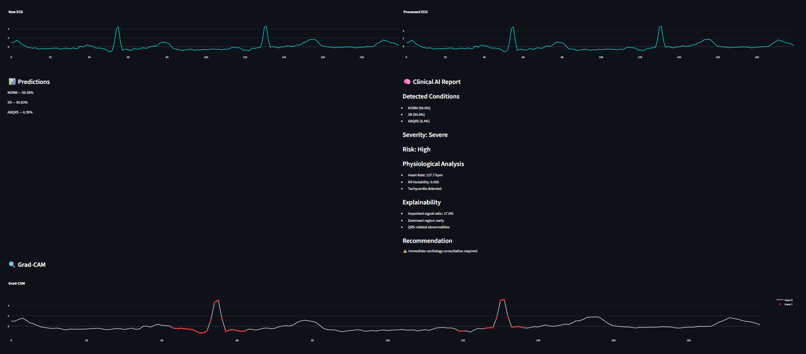
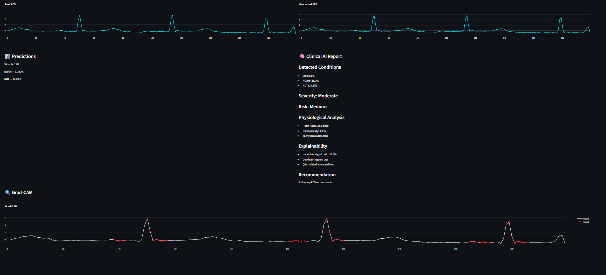
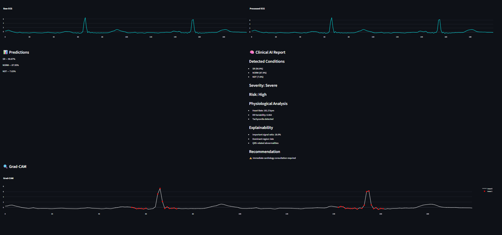

# ❤️ ECG AI Diagnosis Platform

##  Executive Overview

The **ECG AI Diagnosis Platform** is an advanced, end-to-end intelligent system designed to transform raw electrocardiogram (ECG) signals into clinically meaningful insights using **deep learning, explainable AI (XAI), and rule-based medical reasoning**.

Unlike conventional machine learning projects that focus solely on classification accuracy, this system is engineered as a **clinical decision-support prototype**, bridging the critical gap between:

> **Black-box AI predictions** ⟶ **Human-interpretable medical reasoning**

---

##  Core Objective

To develop a system capable of:

- Accurately detecting **multiple cardiac conditions simultaneously** (multi-label classification)
- Providing **interpretable explanations** of model behavior
- Translating predictions into **clinically actionable insights**

---

##  Key Innovations

This project introduces a **three-layer intelligence framework**:

### 1.  Deep Learning Layer
- Hybrid architecture (CNN + BiLSTM + Attention)
- Learns both spatial and temporal ECG patterns
- Handles complex multi-label cardiac diagnosis

---

### 2.  Explainability Layer (XAI)
- Grad-CAM adapted for 1D ECG signals
- Identifies **which parts of the signal influenced the decision**
- Converts model attention into interpretable features

---

### 3.  Clinical Reasoning Engine
- Converts raw predictions into:
  - Severity grading (Mild / Moderate / Severe)
  - Risk estimation (Low / Medium / High)
  - Physiological interpretation (HR, variability, anomalies)
  - Medical recommendations

---

##  Why This Project is Different

Most ECG AI systems:
- Output predictions only ❌  
- Lack interpretability ❌  
- Are not clinically usable ❌  

This system:
- Provides **multi-label diagnosis** ✔  
- Explains **why the model made a decision** ✔  
- Generates **medical-style reports** ✔  

---

##  Disclaimer

This system is developed for:
- Research
- Educational purposes
- AI experimentation

It is **NOT intended for real clinical use without validation and regulatory approval**.

---

##  System Preview



##  System Workflow & Visual Intelligence Flow

The ECG AI Diagnosis Platform operates as a **multi-stage intelligent pipeline**, where each stage transforms the signal into progressively richer representations — from raw waveform to clinical insight.

This section presents the **end-to-end journey of the signal inside the system**.

---

##  Stage 1 — User Interaction & Data Input

The system begins with a simple, intuitive interface allowing users to:

- Upload ECG data (CSV format)
- Trigger real-time analysis
- Re-run experiments instantly

This design ensures usability for both **technical users and non-experts**.

###  Interface Preview


---

##  Stage 2 — Signal Acquisition

Once uploaded, the system reads the ECG signal and prepares it for analysis.

Key characteristics:
- Time-series biomedical signal
- Potentially noisy and irregular
- Requires preprocessing before inference

###  Raw ECG Signal



---

##  Stage 3 — Signal Processing & Normalization

Before entering the model, the signal undergoes critical transformations:

- Noise filtering
- Z-score normalization
- Segmentation into fixed-length windows

This stage ensures:
✔ Stability  
✔ Consistency  
✔ Model readiness  

###  Processed ECG Signal



---

##  Stage 4 — Deep Learning Inference

The processed signal is passed into a hybrid deep learning model that:

- Extracts waveform features (CNN)
- Captures temporal dependencies (LSTM)
- Focuses on important segments (Attention)

The output is a **multi-label probability vector** representing different cardiac conditions.

###  Prediction Output



---

##  Stage 5 — Explainability Layer (Grad-CAM)

Instead of stopping at predictions, the system applies **Grad-CAM** to:

- Identify important regions in the ECG
- Visualize model attention
- Highlight diagnostic segments

This transforms the model from a black-box into an interpretable system.

###  Grad-CAM Visualization



---

##  Stage 6 — Clinical Reasoning Engine

The final stage translates model outputs into **human-readable clinical insights**:

- Detected conditions (ranked)
- Severity estimation
- Risk level
- Physiological interpretation
- Medical recommendations

###  Clinical Report



---

##  Full Pipeline Summary
User Input
↓
Raw ECG Signal
↓
Signal Processing
↓
Deep Learning Model
↓
Explainable AI (Grad-CAM)
↓
Clinical Reasoning Engine
↓
Final Medical Report

---

##  Key Insight

This workflow ensures that the system does not merely answer:

> "What is the prediction?"

But instead answers:

> **"What is happening in the heart, why did the model decide this, and what should be done next?"**

---

##  Design Philosophy

The pipeline is built around three principles:

1. **Interpretability First**
2. **Clinical Relevance**
3. **End-to-End Intelligence**

---
##  Deep Learning Architecture & Design Rationale

At the core of this system lies a **hybrid deep learning architecture** specifically designed to handle the complexity of **ECG time-series signals**.

Unlike standard models, this architecture combines **spatial feature extraction, temporal modeling, and attention mechanisms** to capture both local and global cardiac patterns.

---

## 🏗️ Architecture Overview

The model follows a layered design:
Input ECG (1D Signal)
↓
Conv1D Layers (Feature Extraction)
↓
Batch Normalization + Activation
↓
BiLSTM (Temporal Understanding)
↓
Attention Mechanism (Focus Layer)
↓
Dense Layers (Decision Layer)
↓
Sigmoid Output (Multi-label Prediction)

---

##  Layer-by-Layer Breakdown

### 🔹 1. Input Layer
- Shape: `(200, 1)`
- Represents a fixed ECG segment
- Standardized input for model consistency

---

###  2. Convolutional Layers (Conv1D)

Purpose:
- Extract **local morphological features**

What it learns:
- QRS complexes
- Peaks and valleys
- Sudden signal changes

Why Conv1D?
- ECG is a waveform → spatial patterns matter

---

###  3. Batch Normalization

Purpose:
- Stabilize training
- Reduce internal covariate shift

Benefit:
✔ Faster convergence  
✔ Better generalization  

---

###  4. BiLSTM (Bidirectional LSTM)

Purpose:
- Capture **temporal dependencies**

Why Bidirectional?
- ECG patterns depend on **past + future context**

What it captures:
- Rhythm irregularities
- Temporal anomalies
- Heartbeat sequences

---

###  5. Attention Mechanism

 This is a key innovation

Purpose:
- Allow the model to **focus on important signal regions**

Instead of:
> treating all time steps equally ❌  

It learns:
> which parts of the ECG matter most ✔  

---

###  6. Dense Layers

Purpose:
- Combine extracted features
- Perform high-level reasoning

---

###  7. Output Layer (Sigmoid)

- Multi-label output
- Each neuron = one cardiac condition

Example output:
[0.91, 0.76, 0.12, 0.65, ...]

---

##  Why Multi-label Instead of Multi-class?

Traditional approach:
- One condition per signal ❌

Real-world ECG:
- Multiple abnormalities can coexist ✔

Example:
- AFIB + PVC  
- LVH + ST changes 

---

##  Design Philosophy

The architecture is built around three core ideas:

### 1. Feature Hierarchy
- CNN → low-level features  
- LSTM → temporal structure  
- Attention → importance weighting  

---

### 2. Medical Alignment
Each layer maps to a clinical concept:

| Model Component | Clinical Meaning |
|----------------|----------------|
| Conv1D         | Morphology detection |
| LSTM           | Rhythm analysis |
| Attention      | Diagnostic focus |

---

### 3. Interpretability-Ready Design
The architecture is intentionally designed to support:
- Grad-CAM
- Signal attribution
- Clinical explanation

---

##  Challenges in Model Design

### 1. Noisy Signals
✔ Solved via preprocessing

### 2. Temporal Complexity
✔ Solved using BiLSTM

### 3. Feature Importance
✔ Solved using Attention

### 4. Multi-label ambiguity
✔ Solved using Sigmoid + thresholding

---

##  Key Takeaway

This model is not just a classifier — it is a **structured reasoning system** that learns:

- What patterns exist  
- When they occur  
- How important they are  

---

##  Insight

The true strength of this architecture lies in the combination:

> CNN + LSTM + Attention  

Which transforms ECG analysis from:
Pattern recognition → Context-aware diagnosis  
→ Attention-guided feature attribution  
→ Explainable decision-making  
→ Clinically actionable intelligence

---

##  Signal Processing & Data Pipeline Engineering

Accurate ECG analysis does not start with the model — it starts with **robust signal preparation**.

This system implements a carefully designed preprocessing pipeline to transform **raw, noisy biomedical signals** into structured, model-ready inputs.

---

##  Nature of ECG Signals

ECG signals are:

- Non-stationary time-series data
- Highly sensitive to noise
- Subject to physiological variability
- Prone to artifacts (motion, baseline drift, electrical interference)

---

### 📊 Raw Signal Example


---

##  Challenges in Raw ECG Data

### 1. Noise & Artifacts
- Muscle noise
- Powerline interference
- Baseline drift

---

### 2. Signal Variability
- Different heart rates
- Irregular rhythms
- Patient-specific differences

---

### 3. Inconsistent Length
- Variable recording durations
- Non-uniform sampling segments

---

##  Preprocessing Pipeline

The system applies a structured multi-step pipeline:


Raw ECG
↓
Noise Filtering
↓
Normalization
↓
Segmentation
↓
Model Input


---

## 🔹 Step 1 — Noise Filtering

Purpose:
- Remove high-frequency noise
- Preserve physiological waveform

Technique:
- Butterworth filter (low-pass)

Effect:
✔ Cleaner signal  
✔ Reduced distortion  

---

## 🔹 Step 2 — Normalization

Technique:
- Z-score normalization

Formula:

x' = (x - μ) / σ


Purpose:
- Standardize signal amplitude
- Improve model stability
- Reduce scale bias

---

## 🔹 Step 3 — Segmentation

ECG signals are split into fixed windows:

- Length: ~200 samples
- No overlap (or configurable)

Why segmentation?

- Enables batch processing
- Standardizes input shape
- Improves temporal learning

---

## 🔹 Step 4 — Reshaping

Final input shape:


(batch_size, 200, 1)


---

##  Processed Signal Visualization


---

##  Signal Transformation Insight

The preprocessing pipeline transforms the signal from:


Noisy, irregular waveform
→ Clean, normalized, structured signal


---

##  Why This Pipeline Matters

Without preprocessing:

❌ Model learns noise  
❌ Poor generalization  
❌ Unstable predictions  

With preprocessing:

✔ Clear feature extraction  
✔ Stable training  
✔ Better interpretability  

---

##  Engineering Considerations

###  Real-time Compatibility
- Lightweight operations
- Fast execution

---

###  Model Compatibility
- Fixed input shape
- Consistent distribution

---

###  Explainability Support
- Clean signals improve Grad-CAM clarity

---

##  Key Insight

In biomedical AI systems:

> **Data quality > Model complexity**

A well-processed ECG signal allows even a moderate model to perform better than a complex model trained on noisy data.

---

##  Pipeline Summary


Raw Signal
→ Filtered Signal
→ Normalized Signal
→ Segmented Windows
→ Deep Learning Input


---

##  Final Takeaway

The preprocessing pipeline is not just a preparation step —  
it is a **critical foundation that directly impacts model performance, interpretability, and clinical 

---

##  Explainable AI (Grad-CAM for ECG Signals)

Deep learning models are often criticized as **black-box systems** — especially in high-stakes domains such as healthcare.

This project addresses this limitation by integrating **Explainable AI (XAI)** using a customized version of **Grad-CAM adapted for 1D ECG signals**.

---

##  Why Explainability Matters

In medical AI, predictions alone are not sufficient.

A clinically useful system must answer:

- Why was this diagnosis made?
- Which part of the signal influenced the decision?
- Is the model focusing on physiologically relevant regions?

---

##  What is Grad-CAM?

Grad-CAM (Gradient-weighted Class Activation Mapping) is a technique that:

- Uses gradients flowing into the last convolutional layer
- Generates a heatmap of important regions
- Highlights where the model is “looking”

---

##  Adaptation for ECG (1D Signals)

Traditional Grad-CAM is designed for images (2D).  
In this project, it is adapted for **time-series signals**:

- Heatmap aligned with time axis
- Importance mapped across ECG waveform
- Signal-aware visualization instead of spatial grids

---

##  Grad-CAM Output

The system produces:

### 1. Importance Map
- Highlights key segments in the ECG signal

### 2. Importance Ratio
- Percentage of signal considered relevant

### 3. Dominant Region
- Early segment
- Middle segment
- Late segment

---

##  Visualization Example


---

##  Interpretation Logic

The Grad-CAM output is translated into clinical meaning:

### 🔹 Low Importance Ratio (< 15%)
→ Focus on localized anomalies  
→ Possible isolated spikes or irregular beats  

---

### 🔹 Medium Importance Ratio (15% – 35%)
→ Focus on QRS complexes  
→ Indicates morphology-driven abnormalities  

---

### 🔹 High Importance Ratio (> 35%)
→ Global signal attention  
→ Suggests rhythm-related disorders  

---

##  Signal-Level Insight

Grad-CAM enables mapping from:


Model attention
→ Signal region
→ Physiological meaning


---

##  Example Behavior

- AFIB → attention spread across signal (irregular rhythm)
- PVC → attention spikes at abnormal beats
- LVH → focus on waveform amplitude regions

---

##  Integration with Pipeline

Grad-CAM is applied after model prediction:


ECG Signal
→ Model Prediction
→ Grad-CAM
→ Clinical Interpretation


---

##  Challenges in ECG Explainability

### 1. Temporal Alignment
✔ Solved via interpolation

---

### 2. Noise Sensitivity
✔ Improved via preprocessing

---

### 3. Interpretability Gap
✔ Bridged using clinical mapping rules

---

##  Key Contribution

This system does not just visualize attention —  
it **translates attention into clinically meaningful explanations**.

---

##  Final Insight

Explainability transforms the system from:


Black-box prediction
→ Transparent, interpretable AI


---

##  Takeaway

Grad-CAM in this system is not a visualization tool only —  
it is a **diagnostic reasoning bridge between AI and medicine**.

---

##  Clinical Reasoning Engine

While most AI systems stop at prediction, this platform goes a step further by introducing a **Clinical Reasoning Engine**.

This component transforms raw model outputs into **structured, medically interpretable insights** — effectively simulating a simplified clinical decision-making process.

---

##  Objective

Convert:


Model Probabilities
→ Clinical Understanding
→ Actionable Medical Insight


---

##  Why This Matters

A prediction like:


AFIB = 0.82


Is not clinically sufficient.

A clinician needs:

- Severity level  
- Risk estimation  
- Physiological interpretation  
- Recommended action  

---

##  Reasoning Pipeline

The reasoning engine operates in multiple stages:


Model Output
↓
Label Activation (Thresholding)
↓
Severity Estimation
↓
Risk Assessment
↓
Physiological Interpretation
↓
Clinical Recommendation


---

## 🔹 Step 1 — Multi-label Activation

- Threshold-based filtering (e.g., > 0.5)
- Selects active conditions

Example:

[SR: 0.91, AFIB: 0.78, PVC: 0.12]

→ Active: SR, AFIB


---

##  Step 2 — Severity Assessment

Severity is derived from confidence levels:

- **Mild** → low confidence
- **Moderate** → medium confidence
- **Severe** → high confidence

---

###  Rationale:
Higher model confidence often correlates with stronger pattern presence.

---

##  Step 3 — Risk Estimation

Risk is mapped from severity:

| Severity | Risk Level |
|----------|-----------|
| Mild     | Low       |
| Moderate | Medium    |
| Severe   | High      |

---

##  Step 4 — Physiological Interpretation

This step translates predictions into **cardiac behavior**:

Examples:

- AFIB → Irregular atrial rhythm  
- PVC → Premature ventricular contraction  
- IMI → Possible myocardial infarction pattern  
- LVH → Increased ventricular mass  

---

##  Signal-Based Metrics

Additional insights are derived from the ECG:

- **Heart Rate (HR)**
- **RR Interval Variability**
- **Signal Regularity**

These enhance clinical context beyond classification.

---

##  Step 5 — Clinical Recommendation

Based on risk level:

- **Low Risk**
  → Routine monitoring  

- **Medium Risk**
  → Follow-up ECG recommended  

- **High Risk**
  → Immediate cardiology consultation  

---

##  Example Output


---

##  Full Reasoning Flow


ECG Signal
→ Model Prediction
→ Condition Detection
→ Severity Analysis
→ Risk Estimation
→ Physiological Mapping
→ Clinical Recommendation


---

##  Design Philosophy

The reasoning engine is built on:

### 1. Interpretability
- Every output is explainable

### 2. Clinical Alignment
- Outputs match real-world medical thinking

### 3. Simplicity with Meaning
- Rule-based layer enhances deep learning output

---

##  Limitations

- Rule-based reasoning is simplified
- Not a replacement for medical diagnosis
- Requires clinical validation

---

##  Key Contribution

This component elevates the system from:


Prediction System
→ Clinical Decision-Support Prototype


---

##  Final Insight

The Clinical Reasoning Engine acts as the **bridge between AI and medicine**, ensuring that predictions are not only accurate — but also **understandable, interpretable, and actionable**.


---

##  Results & Model Behavior Analysis

This section presents a detailed analysis of the model’s behavior across different ECG samples, focusing on:

- Multi-label prediction patterns
- Confidence distribution
- Explainability consistency (Grad-CAM)
- Clinical interpretation alignment

---

##  Evaluation Philosophy

Instead of focusing only on numerical metrics (accuracy, F1), this project emphasizes:

- **Behavioral analysis**
- **Interpretability consistency**
- **Clinical plausibility**

---

##  Example 1 — Localized Abnormality



###  Observations:

- One dominant condition with high confidence
- Grad-CAM shows **localized spikes**
- Low importance ratio

###  Interpretation:

- Model focuses on **specific abnormal beats**
- Likely morphology-driven issue (e.g., PVC)

###  Clinical Insight:

- Mild to moderate condition
- Localized irregularity rather than global rhythm issue

---

##  Example 2 — Mixed Pattern (Multi-label)



###  Observations:

- Multiple active labels
- Medium confidence distribution
- Grad-CAM spans multiple segments

###  Interpretation:

- Model detects **overlapping cardiac conditions**
- Attention is distributed but structured

###  Clinical Insight:

- Indicates combined abnormalities
- Requires follow-up evaluation

---

##  Example 3 — Global Rhythm Abnormality



###  Observations:

- High confidence prediction
- Grad-CAM covers large portion of signal
- High importance ratio

###  Interpretation:

- Model focuses on **global temporal structure**
- Suggests rhythm-based disorder

###  Clinical Insight:

- Potential severe condition (e.g., AFIB)
- Requires immediate attention

---

##  Cross-Example Analysis

| Behavior Type        | Grad-CAM Pattern        | Clinical Meaning              |
|---------------------|------------------------|-------------------------------|
| Localized spikes     | Narrow focus           | Isolated abnormalities        |
| Distributed focus    | Multi-region attention | Multi-condition scenario      |
| Global attention     | Wide coverage          | Rhythm disorders              |

---

##  Model Consistency

Across all examples, the model demonstrates:

✔ Stable prediction behavior  
✔ Consistent Grad-CAM alignment  
✔ Logical relationship between attention and diagnosis  

---

##  Confidence vs Interpretability

A key observation:

- High confidence → broader attention  
- Low confidence → localized attention  

This suggests that the model:

> Adjusts its focus dynamically based on pattern complexity

---

##  Prediction Behavior Insight

The model does not rely on:

❌ Single peak detection only  

Instead, it combines:

✔ Morphological features  
✔ Temporal dependencies  
✔ Contextual signal patterns  

---

##  Observed Limitations

- Sensitivity to noisy segments
- Overlapping labels may reduce interpretability clarity
- Edge cases with ambiguous signals

---

##  Key Insight

The strength of the system lies not only in **what it predicts**, but in:

> **How consistently its internal attention aligns with clinically meaningful signal regions**

---

##  Final Takeaway

This analysis confirms that the model behaves as:


Pattern detector
→ Context analyzer
→ Interpretable decision-maker


---

The combination of multi-label prediction and explainability provides a **holistic understanding of ECG signals**, rather than isolated outputs.

##  Technical Stack & System Implementation

This project is implemented as a **modular, production-oriented AI system**, combining deep learning, signal processing, and interactive visualization.

---

##  Core Technologies

### 🔹 Programming Language
- **Python 3.x**
- Chosen for its strong ecosystem in AI and data science

---

### 🔹 Deep Learning Framework
- **TensorFlow / Keras**

Used for:
- Model architecture definition
- Training and inference
- Integration with Grad-CAM

---

### 🔹 Numerical & Scientific Computing
- **NumPy**
- **SciPy**

Used for:
- Signal processing
- Mathematical operations
- Data manipulation

---

### 🔹 Visualization
- **Plotly**

Used for:
- Interactive ECG plots
- Dynamic visualization of predictions
- Real-time signal exploration

---

### 🔹 Web Interface
- **Streamlit**

Used for:
- Rapid prototyping
- Interactive UI
- Real-time inference display

---

## 🏗️ Project Structure

The system is organized into modular components:

```bash
ecg-ai-system/
│
├── app.py # Main Streamlit application
├── config.py # Configuration settings
│
├── model/
│ ├── ecg_model.keras # Trained model
│ ├── model.py # Model architecture
│ └── train.py # Training pipeline
│
├── preprocessing/
│ ├── ecg_preprocessing.py # Signal cleaning
│ ├── segmentation.py # Windowing logic
│ └── metadata_preprocessing.py
│
├── inference/
│ └── predict.py # Prediction logic
│
├── explainability/
│ ├── gradcam.py # Grad-CAM implementation
│ └── run_gradcam.py # Execution pipeline
│
├── utils/
│ ├── helpers.py
│ └── pdf_report.py
│
├── assets/ # Images for visualization
├── notebooks/ # Experimental analysis
├── requirements.txt
└── README.md
```

---

##  System Flow (Code-Level)


User Input
→ app.py
→ preprocessing/
→ inference/predict.py
→ model
→ explainability/gradcam.py
→ clinical reasoning (inside app)
→ visualization (Plotly + Streamlit)


---

##  Design Principles

### 1. Modularity
Each component is isolated:
- Easy to debug
- Easy to extend
- Easy to maintain

---

### 2. Separation of Concerns
- Preprocessing ≠ Model ≠ Explainability ≠ UI

---

### 3. Reusability
- Functions can be reused across experiments
- Model pipeline is independent of UI

---

### 4. Scalability
System can be extended to:
- API (FastAPI)
- Mobile apps
- Real-time monitoring systems

---

## 🔬 Implementation Highlights

### ✔ Custom Grad-CAM for 1D Signals
- Adapted from 2D image-based version
- Handles time-series alignment

---

### ✔ Multi-label Prediction Pipeline
- Sigmoid output
- Threshold-based activation

---

### ✔ Integrated Clinical Logic
- Implemented directly in Streamlit layer
- Converts predictions into insights

---

### ✔ Real-time Processing
- Signal → Prediction → Visualization in seconds

---

##  Engineering Challenges

### 1. Framework Compatibility
- TensorFlow vs Streamlit Cloud
✔ Solved via local deployment

---

### 2. Model Serialization Issues
- Keras version mismatch
✔ Managed via consistent environment

---

### 3. Explainability Integration
- Aligning Grad-CAM with signal
✔ Solved via interpolation

---

##  Key Insight

This system is not just a script —  
it is structured as a **mini AI platform**, combining:

- Data pipeline  
- Model inference  
- Explainability  
- Clinical reasoning  
- Interactive visualization  

---

##  Final Takeaway

The implementation reflects a shift from:


Notebook-based experimentation
→ Structured, deployable AI system


---

This design ensures that the project is:

✔ Understandable  
✔ Extendable  
✔ Production-ready (with minor enhancements)  


##  Challenges, Limitations & Future Work

Building an intelligent ECG analysis system involves multiple layers of complexity — from signal noise to model interpretability and deployment constraints.

This section outlines the **key challenges encountered**, current **system limitations**, and **future improvements**.

---

##  Key Challenges

### 🔹 1. Noisy Biomedical Signals

ECG data is inherently noisy and affected by:

- Motion artifacts
- Baseline drift
- Electrical interference

✔ Mitigation:
- Butterworth filtering
- Normalization pipeline

---

### 🔹 2. Temporal Complexity

Cardiac signals are not static — they evolve over time.

Challenge:
- Capturing both local patterns and long-term dependencies

✔ Solution:
- Hybrid architecture (CNN + BiLSTM + Attention)

---

### 🔹 3. Multi-label Ambiguity

Unlike traditional classification:

- Multiple conditions can coexist
- Labels may overlap

✔ Solution:
- Sigmoid activation
- Threshold-based selection

---

### 🔹 4. Explainability Gap

Raw Grad-CAM outputs are not directly interpretable by clinicians.

✔ Solution:
- Post-processing into:
  - Importance ratio
  - Dominant region
  - Clinical interpretation

---

### 🔹 5. Model–Clinical Gap

AI predictions are numerical, while clinicians think in:

- Severity
- Risk
- Diagnosis context

✔ Solution:
- Clinical Reasoning Engine

---

### 🔹 6. Deployment Constraints

- TensorFlow compatibility issues
- Streamlit Cloud limitations

✔ Workaround:
- Local deployment
- Potential API-based architecture

---

##  Current Limitations

### ❌ 1. Limited Dataset Generalization
- Model trained on specific dataset
- May not generalize across all populations

---

### ❌ 2. Rule-Based Clinical Layer
- Clinical reasoning is heuristic (not learned)
- Lacks full medical validation

---

### ❌ 3. Grad-CAM Approximation
- Provides approximate importance
- Not a perfect explanation

---

### ❌ 4. No Real-Time Streaming
- Currently processes static ECG segments
- No live monitoring support

---

### ❌ 5. Evaluation Metrics Not Fully Integrated
- Focus is on interpretability and behavior
- Formal benchmarking can be expanded

---

##  Future Work

### 🔹 1. Dataset Expansion
- Incorporate multi-source ECG datasets
- Improve generalization

---

### 🔹 2. Advanced Explainability
- SHAP for time-series
- Integrated gradients
- Attention visualization

---

### 🔹 3. End-to-End Clinical Modeling
- Replace rule-based reasoning with learned models
- Integrate medical knowledge graphs

---

### 🔹 4. Real-Time ECG Monitoring
- Stream processing
- Continuous signal analysis

---

### 🔹 5. API-Based Deployment
- FastAPI backend
- Streamlit frontend
- Cloud-ready architecture

---

### 🔹 6. Model Optimization
- Reduce latency
- Lightweight models for edge deployment

---

### 🔹 7. Clinical Validation
- Collaboration with cardiologists
- Real-world evaluation

---

##  Research Perspective

This project highlights an important insight:

> High model accuracy alone is not sufficient for real-world medical AI.

True impact requires:

- Interpretability  
- Clinical alignment  
- Usability  

---

##  Key Takeaway

The system represents a strong foundation for:
Research Prototype
→ Clinical Decision-Support System
→ Real-world Healthcare Application


---

##  Evolution Path


Current System
→ Enhanced Explainability
→ Clinical Integration
→ Regulatory Validation


---

##  Final Insight

The future of AI in healthcare is not about replacing clinicians —  
but about **augmenting their decision-making with transparent, reliable intelligence**.


## 🚀 Installation & Usage


```bash
###  1. Clone the Repository
git clone https://github.com/alaashorbaji96-hue/ecg-ai-system.git
cd ecg-ai-system
 2. Create Virtual Environment (Recommended)
python -m venv venv
venv\Scripts\activate   # Windows
 3. Install Dependencies
pip install -r requirements.txt
 4. Run the Application
streamlit run app.py
 5. Open in Browser

http://localhost:8501
```
 How to Use the System
Upload an ECG signal (CSV format)
Visualize the raw and processed signal
View model predictions (multi-label)
Analyze Grad-CAM explainability
Read the clinical AI report:
Detected conditions
Severity level
Risk estimation
Medical recommendation
 Usage Notes
Best performance achieved in local environment
TensorFlow is required for full functionality
Streamlit Cloud may run in limited/demo mode
 Project Positioning

This project represents a transition from:

Academic Experiment
→ Applied AI System
→ Clinical Decision-Support Prototype

 Potential Applications
ECG analysis tools
AI-assisted cardiology systems
Medical education platforms
Research in explainable AI for healthcare
👨‍💻 Author

Alaa Shorbaji

AI Engineer & Instructor
Specialized in:
Deep Learning
Explainable AI (XAI)
Medical AI Systems
🔗 GitHub

https://github.com/alaashorbaji96-hue

💡 About This Work

This project reflects a strong focus on:

Bridging AI with real-world applications
Building interpretable systems
Designing end-to-end intelligent pipelines
 Final Statement

The ECG AI Diagnosis Platform is not just a model —
it is a step toward building transparent, clinically meaningful AI systems that can assist human experts in high-stakes environments.


